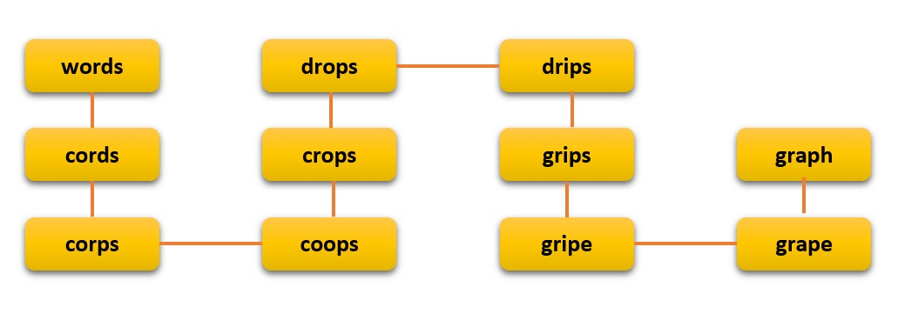
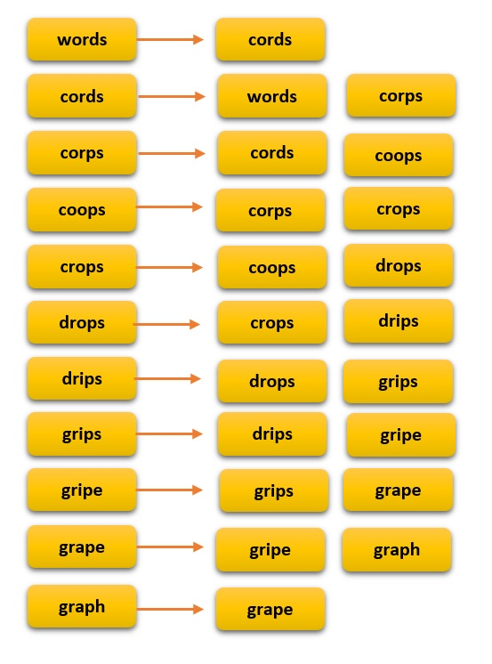
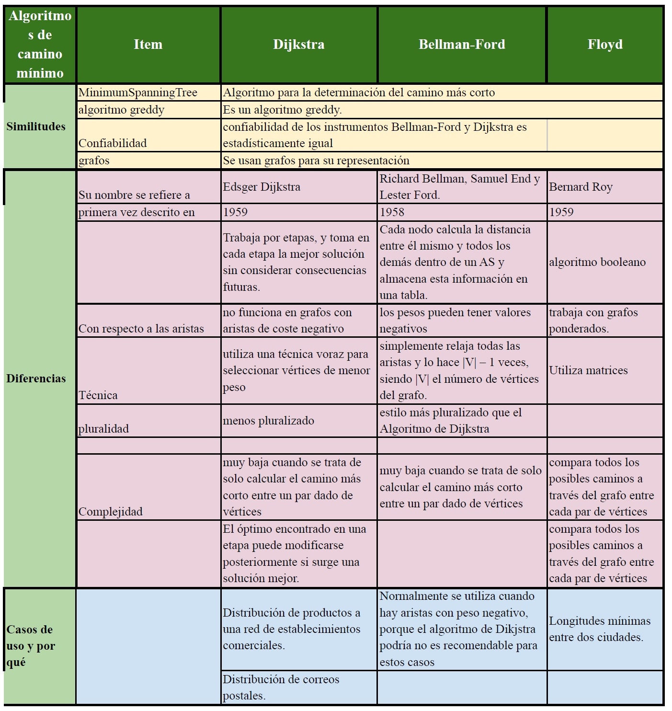

<table>
    <theader>
        <tr>
            <td></td>
            <th>
                UNIVERSIDAD NACIONAL DE SAN AGUSTIN 
                FACULTAD DE INGENIERÍA DE PRODUCCIÓN Y SERVICIOS 
                ESCUELA PROFESIONAL DE INGENIERÍA DE SISTEMAS
            </th>
            <td></td>
        </tr>
    </theader>
    <tbody>
        <tr><td colspan="3">Formato: Guía de Práctica de Laboratorio / Talleres / Centros de Simulación</td></tr>
        <tr><td>Aprobación:  2022/03/01</td><td>Código: GUIA-PRLE-001</td><td>Página: 1</td></tr>
    </tbody>
</table>

INFORME DE LABORATORIO 

<table>
<theader>
<tr><th colspan="6">INFORMACIÓN BÁSICA</th></tr>
</theader>
<tbody>
<tr><td>ASIGNATURA:</td><td colspan="5">Estructura de Datos y Algoritmos</td></tr>
<tr><td>TÍTULO DE LA PRÁCTICA:</td><td colspan="5">Grafos</td></tr>
<tr>
<td>NÚMERO DE PRÁCTICA:</td><td>08</td><td>AÑO LECTIVO:</td><td>2022 A</td><td>NRO. SEMESTRE:</td><td>III</td>
</tr>
<tr>
<td>FECHA DE PRESENTACIÓN:</td><td>21/08/2022</td><td>HORA DE PRESENTACIÓN: 11:55 pm</td><td colspan="3"></td>
</tr>
<tr><td colspan="3">INTEGRANTE(s):
<ul>
      			<li><a href="https://github.com/fernandocoylaA">Fernando Jesús Coyla Alvarez</a></li>
			<li><a href="https://github.com/Icielo23">Valery Cielo Iquise Mamani</a></li>
			<li><a href="https://github.com/Mario-Chura">Mario Franco Chura Puma</a></li>
</ul>
</td>
<td>NOTA:</td><td colspan="2"></td>
</<tr>
<tr><td colspan="6">DOCENTE(s):
<ul>
<li>Richart Smith Escobedo Quispe - rescobedoq@unsa.edu.pe</li>
</ul>
</td>
</<tr>
</tbody>
</table>

  

  

<h2> SOLUCIÓN Y RESULTADOS </h2>

### I.	SOLUCIÓN DE EJERCICIOS/PROBLEMAS
#	
1.  Ejercicio 1: Crear un repositorio en GitHub, donde incluyan la resolución de los ejercicios propuestos y el informe.
	- El link del repositorio es el siguiente: https://github.com/Mario-Chura/EDA-22A-GrupoE01-Lab08.git 
2.  Ejercicio 2: Implementar el cogido de Grafo cuya representación sea realizada mediante LISTA DE ADYACENCIA. (3 puntos)
	- Procedimiento
3.  Ejercicio 3: Implementar BSF, DFS y Dijkstra con sus respectivos casos de prueba. (5 puntos)
	- Procedimiento
4.  Ejercicio 4: Solucionar el siguiente ejercicio: (5 puntos)
El grafo de palabras se define de la siguiente manera: cada vértice es una palabra en el idioma Inglés y dos palabras son adyacentes si difieren exactamente en una posición. Por ejemplo, las cords y los corps son adyacentes, mientras que los corps y crops no lo son. 
- Definimos el grafo de la siguiente manera: cada vértice es una palabra en el idioma inglés y dos palabras son adyacentes si se diferencian exactamente en una posición. Por ejemplo, las cords y los corps son adyacentes, mientras que los corps y crops no lo son.

	a) Dibuje el grafo definido por las siguientes palabras: words cords corps coops crops drops drips grips gripe grape graph  
	
	
	
	b) Mostrar la lista de adyacencia del grafo.  
	
	
	
5.  Ejercicio 5: Realizar un método en la clase Grafo. Este método permitirá saber si un grafo está incluido en otro. Los parámetros de entrada son 2 grafos y la salida del método es true si hay inclusión y false el caso contrario. (4 puntos)
	- Procedimiento

	
   
#

### II.	SOLUCIÓN DEL CUESTIONARIO

#
-¿Cuantas variantes del algoritmo de Dijkstra hay y cuál es la diferencia entre ellas? (1 puntos)  

- El algoritmo de Dijkstra es un algoritmo para la búsqueda de las rutas más cortas entre los nodos en un gráfico, que puede representar, por ejemplo, redes de carreteras. Fue concebido por el científico informático Edsger W. Dijkstra en 1956 y publicado tres años después. El algoritmo de Dijkstra sirve para encontrar el camino más corto entre un a y b . Selecciona el vértice no visitado con la distancia más baja, calcula la distancia a través de él hasta cada vecino no visitado y actualiza la distancia del vecino si es menor. Se marca como visitado (puesto en rojo) cuando termine con los vecinos.
- Variantes del algoritmo de Dijkstra:
	- Cuando los pesos de arco son números enteros pequeños (delimitados por un parámetro C), las colas especializadas que aprovechan este hecho se pueden utilizar para acelerar el algoritmo de Dijkstra. El primer algoritmo de este tipo fue el algoritmo de Dial ( Dial 1969 ) para gráficos con pesos de borde enteros positivos, que usa una cola de cubos para obtener un tiempo de ejecución.{\displaystyle O(|E|+|V|C)}.
	-  El uso de un árbol de Van Emde Boas como cola de prioridad aporta complejidad a{\displaystyle O(|E|\log \log C)}( Ahuja et al. 1990 ). 
	-  Otra variante interesante basada en una combinación de un nuevo montón de radix y el conocido montón de Fibonacci se ejecuta en el tiempo{\displaystyle O(|E|+|V|{\sqrt {\log C}})}( Ahuja et al. 1990 ).
	-   Finalmente, los mejores algoritmos en este caso especial son los siguientes. El algoritmo dado por ( Thorup 2000 ) se ejecuta enO(|E|\log \log |V|)tiempo y el algoritmo dado por ( Raman 1997 ) se ejecuta en{\displaystyle O(|E|+|V|\min\{(\log |V|)^{1/3+\varepsilon },(\log C)^{1/4+\varepsilon }\})} hora.

-Invetigue sobre los ALGORITMOS DE CAMINOS MINIMOS e indique, ¿Qué similitudes encuentra, qué diferencias, en qué casos utilizar y porque? (2 puntos)  

Es importante recordar que el problema de Caminos Mínimos se presenta en muchas situaciones de aplicación real, como es el caso de transporte, telecomunicaciones, industria, aplicaciones geográficas y planeamientos, lo cual hace relevante su aprendizaje. El problema del camino más corto es aquel que consiste en encontrar un camino entre dos nodos de manera que la suma de los costes de los nodos que lo constituyen es mínima. Por supuesto, este tipo de algoritmos permiten estudiar costes de trayecto diferentes, como la distancia, el tiempo de viaje, el coste generalizado, etc.
- Algoritmos de Dijkstra:
También llamado algoritmo de caminos mínimos, es un algoritmo para la determinación del camino más corto dado un vértice origen al resto de vértices en un grafo con pesos en cada arista. Su nombre se refiere a Edsger Dijkstra, quien lo describió por primera vez en 1959.
Resuelve el problema de los caminos más cortos desde un único nodo origen hasta todos los otros nodos del grafo (aunque aplicando una regla de repetición del algoritmo, se puede automatizar la resolución del problema desde todos los nodos de origen hasta todos los nodos del grafo).
- Algoritmo de Bellman-Ford:
Resuelve el problema de los caminos más cortos desde un origen permitiendo que la ponderación de los nodos sea negativa. El algoritmo de Bellman-Ford determina la ruta más corta desde un nodo origen hacia los demás nodos para ello es requerido como entrada un grafo cuyas aristas posean pesos. La diferencia de este algoritmo con los demás es que los pesos pueden tener valores negativos ya que Bellman-Ford me permite detectar la existencia de un ciclo negativo.
El algoritmo de Dijkstra resuelve este mismo problema en un tiempo menor, pero requiere que los pesos de las aristas no sean negativos, salvo que el grafo sea dirigido y sin ciclos. Por lo que el Algoritmo Bellman-Ford normalmente se utiliza cuando hay aristas con peso negativo. Este algoritmo fue desarrollado por Richard Bellman, Samuel End y Lester Ford.
- Algoritmo de Floyd:
Resuelve el problema de los caminos más cortos entre todos los nodos. En informática, el algoritmo de Floyd-Warshall, descrito en 1959 por Bernard Roy, es un algoritmo de análisis sobre grafos para encontrar el camino mínimo en grafos dirigidos ponderados. El algoritmo encuentra el camino entre todos los pares de vértices en una única ejecución. El algoritmo de Floyd-Warshall es un ejemplo de programación dinámica.
- Algoritmo de Búsqueda A*:
Resuelve el problema de los caminos más cortos entre un par de nodos usando la heurística para agilizar la búsqueda.
- Algoritmo de Johnson:
Resuelve el problema de los caminos más cortos entre todos los nodos y puede ser más rápido que el de Floyd-Warshall en grafos de baja densidad.
- Algoritmo de Viterbi:
Resuelve el problema del camino estocástico más corto con un peso probabilístico adicional en cada nodo.
- MinimumSpanningTree
Se analiza los 3 algoritmos más importantes:

#

### III.	CONCLUSIONES
#
-Conclusion 1  
-Conclusion 2  
-Conclusion 3  
-Conclusion 4  
-Conclusion 5  
#

<h2>  RETROALIMENTACIÓN GENERAL </h2>
  

<h2> REFERENCIAS Y BIBLIOGRAFÍA </h2>
  

-   http://bioinfo.uib.es/~joemiro/teach/labmat/Old/labmatold/2006_7/TdGrafos.pdf
-   http://bioinfo.uib.es/~joemiro/teach/labmat/Old/labmatold/2006_7/TdGrafos.pdf
-   Escuela de Pedagogía en Educación Matemática, Marcelino Álvarez, et.al., http://repobib.ubiobio.cl/jspui/bitstream/123456789/1953/3/Alvarez_Nunez_Marcelino.pdf
-   Weiss M., Data Structures & Problem Solving Using Java, 2010, Addison-Wesley.
-   http://www.dma.fi.upm.es/personal/gregorio/matematica_discreta_II/31DistCaminos.pdf
-   https://www.ecured.cu/Algoritmo_de_Dijkstra
-   https://jariasf.wordpress.com/2013/01/01/camino-mas-corto-algoritmo-de-bellman-ford/
